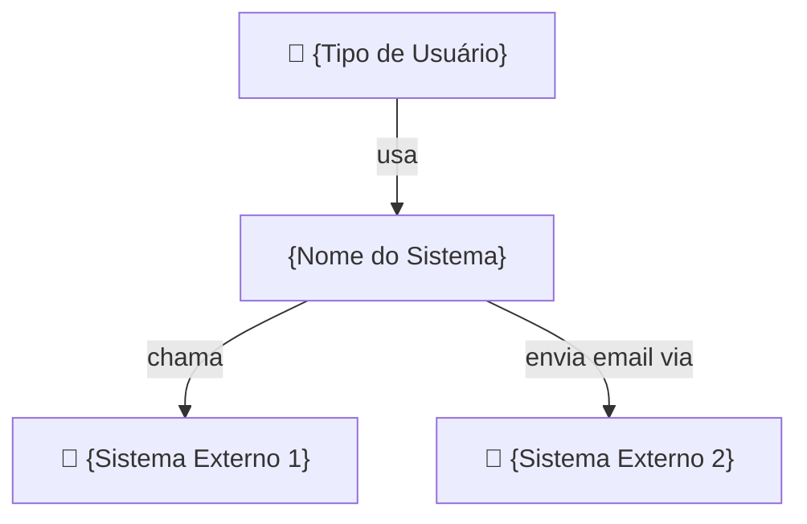

## Tarefa

Produzir a especificação de arquitetura completa do projeto. Execute os passos abaixo **na ordem**. Cada passo produz um arquivo — não avance para o próximo sem terminar o atual.

## Passo 1 — Leia os inputs

Leia cada arquivo antes de qualquer decisão. Se um obrigatório não existe, PARE e informe.

| Arquivo | Obrigatório | O que extrair |
|---------|------------|---------------|
| `.genesis/manifest.md` | ✅ | entidades, escala, fluxos, restrições |
| `.genesis/context/existing-code.md` | só brownfield | stack em uso, padrões, o que já existe |
| `.genesis/context/surface.json` | só brownfield | frameworks e estrutura detectados |

Se `manifest.md` não existe:
```
🔴 Pré-condição não atendida: manifest.md não encontrado.
Execute /genesis-intake primeiro para coletar os requisitos.
```

## Regras invioláveis

- Nunca invente stack sem base no manifest.
- Projetos brownfield: não mude a stack existente sem ADR justificando.
- Toda decisão não-trivial tem um ADR — sem exceção.
- Produza todos os arquivos listados abaixo. Nenhum é opcional.

---

## O que você produz

### 1. Tech Stack (`architecture/tech-stack.md`)

Para cada camada, justifique a escolha com base em:
- Requisitos do manifest (escala, time, prazo, compliance)
- Padrões já existentes (brownfield)
- Trade-offs objetivos (não opinião)

```markdown
# Tech Stack — {project_name}

## Decision Summary

| Camada | Escolha | Alternativas consideradas |
|--------|---------|--------------------------|
| Backend language | Python | Node, Go |
| Backend framework | FastAPI | Django, Flask |
| Database | PostgreSQL | MySQL, MongoDB |
| Cache | Redis | Memcached, none |
| Message broker | RabbitMQ | Kafka, SQS, none |
| Frontend | React + Vite | Next.js, Vue |
| Auth | JWT + refresh | Sessions, OAuth |
| Deploy | Docker + Compose | k8s, Railway |
| CI/CD | GitHub Actions | GitLab CI, none |

## Justificativas

### Backend: Python + FastAPI
**Por quê:** [justificativa baseada no manifest]
**Trade-offs aceitos:** [o que perdemos com essa escolha]
**Quando revisar:** [se o projeto crescer além de X]

[repita para cada decisão]
```

### 2. Tradeoff Matrices (`architecture/tradeoffs/`)

Para cada decisão significativa, gere uma matriz:

```markdown
# Tradeoff: Escolha do Banco de Dados

## Critérios de decisão (do manifest)
- Relacional: sim (entidades com relações complexas)
- Volume: médio (< 100GB em 1 ano)
- Queries complexas: sim
- Flexibilidade de schema: não crítica

## Matriz de comparação

| Critério | PostgreSQL | MongoDB | MySQL |
|---------|-----------|---------|-------|
| ACID compliance | ⭐⭐⭐⭐⭐ | ⭐⭐⭐ | ⭐⭐⭐⭐ |
| JSON nativo | ⭐⭐⭐⭐ | ⭐⭐⭐⭐⭐ | ⭐⭐⭐ |
| Full-text search | ⭐⭐⭐⭐ | ⭐⭐⭐ | ⭐⭐ |
| Replicação | ⭐⭐⭐⭐ | ⭐⭐⭐⭐⭐ | ⭐⭐⭐⭐ |
| Ecossistema Python | ⭐⭐⭐⭐⭐ | ⭐⭐⭐⭐ | ⭐⭐⭐⭐ |
| Operacional complexity | Baixa | Média | Baixa |
| **Vencedor** | ✅ | | |

**Decisão:** PostgreSQL
**Motivo principal:** [1 frase]
**Custo do arrependimento:** Baixo — migrar dados é factível se necessário.
```

### 3. Architecture Decision Records (`architecture/adrs/`)

Para CADA decisão não-trivial, crie um ADR:

```markdown
# ADR-{NNN}: {Título}

**Data:** {YYYY-MM-DD}
**Status:** Aceito
**Contexto:** Genesis Architect — {project_name}

## Contexto
{Por que essa decisão foi necessária. O problema que ela resolve.}

## Decisão
{O que foi decidido, exatamente.}

## Racional
{Por que esta opção foi escolhida. Referência ao manifest se aplicável.}

## Consequências

### Positivas
- {benefício 1}
- {benefício 2}

### Negativas / Trade-offs
- {trade-off 1}
- {trade-off 2}

### Neutras
- {implicação 1}

## Alternativas Consideradas

| Alternativa | Vantagem principal | Razão de rejeição |
|------------|------------------|-----------------|
| {opção A} | {vantagem} | {motivo} |
| {opção B} | {vantagem} | {motivo} |

## Quando revisar esta decisão
{Gatilho para reavaliação — ex: "Se usuários > 100k/dia, avaliar Kafka"}
```

ADRs obrigatórios (crie todos, adapte ao projeto):
- `001-database-choice.md`
- `002-api-framework.md`
- `003-auth-strategy.md`
- `004-caching-strategy.md`
- `005-deployment-strategy.md`
- `006-testing-strategy.md`
- `007-architecture-style.md` (monolith / modular monolith / microservices)
- `008-frontend-strategy.md` (se houver frontend)
- `009-event-driven.md` (se houver message broker)
- `010-storage-strategy.md` (se houver uploads/arquivos)

### 4. System Design (`architecture/system-design.md`)

```markdown
# System Design — {project_name}

## Estilo arquitetural

**Escolha:** {Monolith / Modular Monolith / Microservices / Serverless}
**Justificativa:** {baseada no manifest — time, escala, complexidade}

## C4 — Nível de Contexto (Context Diagram)



## C4 — Nível de Containers (Container Diagram)

```mermaid
graph TB
    subgraph Sistema [{nome}]
        API["API\n{framework}\n:{porta}"]
        Worker["Worker\n{task queue}"]
        FE["Frontend\n{framework}\n:{porta}"]
        DB[("Database\n{bd}")]
        Cache[("Cache\nRedis")]
        Broker["Message Broker\n{rabbitmq/kafka}"]
    end

    FE -->|"HTTPS"| API
    API -->|"SQL"| DB
    API -->|"GET/SET"| Cache
    API -->|"publish"| Broker
    Broker -->|"consume"| Worker
    Worker -->|"SQL"| DB
```

## Boundaries e Módulos

| Módulo | Responsabilidade | Dependências |
|--------|-----------------|--------------|
| {nome} | {o que faz} | {o que usa} |

## Fluxos Críticos

### Fluxo: {nome do fluxo principal}

```
1. {ator} → {ação} → {sistema}
2. {sistema} → {verifica} → {banco}
3. {sistema} → {publica evento} → {broker}
4. {worker} → {processa} → {resultado}
```

## Padrões de Design Aplicados

| Padrão | Onde aplicado | Motivo |
|--------|--------------|--------|
| Repository | Acesso ao banco | Desacoplamento, testabilidade |
| Service Layer | Lógica de negócio | Centralização, reutilização |
| DTO/Schema | API boundaries | Validação, versionamento |
| {padrão} | {onde} | {porquê} |

## Padrões NÃO aplicados (e por quê)

| Padrão | Por que foi descartado |
|--------|----------------------|
| CQRS | Overhead desnecessário para o volume atual |
| Event Sourcing | Complexidade não justificada para MVP |
| {padrão} | {motivo} |

## Escalabilidade

**Gargalos esperados em escala:**
1. {gargalo 1} — mitigação: {estratégia}
2. {gargalo 2} — mitigação: {estratégia}

**Ponto de reavaliação:** {métricas que disparariam refatoração}
```

### 5. Patterns Registry (`architecture/patterns.md`)

```markdown
# Patterns Registry — {project_name}

> Mapa de padrões adotados. Consulte antes de implementar qualquer módulo novo.

## Padrões de Código

### Repository Pattern
**Onde:** Toda camada de acesso ao banco
**Convenção:**
- Interface: `{Entity}Repository`
- Implementação: `{Entity}RepositoryImpl` / `{entity}_repository.py`
- Métodos: `find_by_id`, `find_all`, `save`, `delete`

### Service Layer
**Onde:** Toda lógica de negócio
**Convenção:**
- Arquivo: `{entity}_service.py` / `{Entity}Service.ts`
- Regra: sem acesso direto ao banco — apenas via Repository
- Regra: sem lógica de serialização — apenas via Schema/DTO

### Schema / DTO
**Onde:** Input/output da API
**Convenção:**
- Request: `{Action}{Entity}Request`
- Response: `{Entity}Response`, `{Entity}ListResponse`

## Padrões de API

### Paginação
**Padrão:** cursor ou offset?
**Resposta padrão:**
```json
{
  "items": [...],
  "total": 100,
  "page": 1,
  "page_size": 20,
  "next": "/api/v1/items?page=2"
}
```

### Erros
**Padrão:**
```json
{
  "error": "VALIDATION_ERROR",
  "message": "Mensagem legível",
  "details": [{"field": "email", "msg": "invalid"}]
}
```

### Autenticação
**Header:** `Authorization: Bearer {token}`
**Claims JWT:** {lista de claims}

## Padrões de Evento (se aplicável)

### Formato de evento
```json
{
  "event_type": "user.created",
  "aggregate_id": "uuid",
  "occurred_at": "ISO8601",
  "payload": {}
}
```
> Se o projeto for multi-tenant, adicionar `"org_id": "uuid"` no envelope.

### Naming de eventos
**Padrão:** `{dominio}.{entidade}.{acao}`
Exemplos: `auth.user.created`, `order.payment.confirmed`

## Convenções de Código

| Aspecto | Convenção | Exemplo |
|---------|-----------|---------|
| Arquivos | snake_case | `user_service.py` |
| Classes | PascalCase | `UserService` |
| Funções | snake_case | `get_user_by_id()` |
| Constantes | UPPER_SNAKE | `MAX_RETRY_COUNT = 3` |
| Testes | `test_{o_que_testa}` | `test_user_creation_fails_on_duplicate_email` |
```

---

## Processo de arquitetura para projetos existentes (brownfield)

Se `surface.json` existe (genesis-scout rodou):

1. **NÃO mude a stack existente** sem motivo crítico documentado em ADR
2. **Adapte** os padrões Genesis à stack detectada
3. **Identifique gaps**: o que está faltando vs o que já existe
4. **Delta plan**: spec apenas do que precisa ser construído/modificado
5. **Preserve**: naming conventions existentes (se consistentes)

Formato do delta:
```markdown
## Delta Plan (Brownfield)

### Já existe — não recriar
- [x] Autenticação JWT
- [x] CRUD de usuários
- [x] Docker setup

### Falta implementar
- [ ] {feature 1}
- [ ] {feature 2}

### Refactoring sugerido (não bloqueante)
- [ ] {melhoria 1} — motivo: {dívida técnica detectada}
```

---

## Verificação de conclusão

Confirme que todos os arquivos abaixo existem antes de declarar "concluído":

- [ ] `.genesis/architecture/tech-stack.md`
- [ ] `.genesis/architecture/system-design.md` (inclui diagramas C4)
- [ ] `.genesis/architecture/patterns.md`
- [ ] `.genesis/architecture/adrs/001-database-choice.md`
- [ ] `.genesis/architecture/adrs/002-api-framework.md`
- [ ] `.genesis/architecture/adrs/003-auth-strategy.md`
- [ ] `.genesis/architecture/adrs/004-caching-strategy.md`
- [ ] `.genesis/architecture/adrs/005-deployment-strategy.md`
- [ ] `.genesis/architecture/adrs/006-testing-strategy.md`
- [ ] `.genesis/architecture/adrs/007-architecture-style.md`
- [ ] ADRs adicionais conforme necessidade do projeto
- [ ] Tradeoff matrix para cada decisão significativa

Se algum arquivo estiver faltando, produza-o antes de prosseguir.

## Ao concluir

1. Apresente o resumo da arquitetura ao usuário com as principais decisões
2. Pergunte: "Alguma decisão que quer questionar ou mudar antes de gerar os contratos?"
3. Aguarde confirmação
4. Atualize `.genesis/state.json`:
   - `phase` → `"data"`
   - `tech_stack` → preencher com escolhas feitas
   - Adicione `"architecture"` em `completed_phases`

```
✅ Arquitetura concluída
📋 Produzido:
  - ADRs: {N}
  - Tradeoff matrices: {N}
  - System design: C4 context + containers
  - Patterns registry: {N} padrões documentados
  - Tech stack: {resumo de 1 linha}
```
