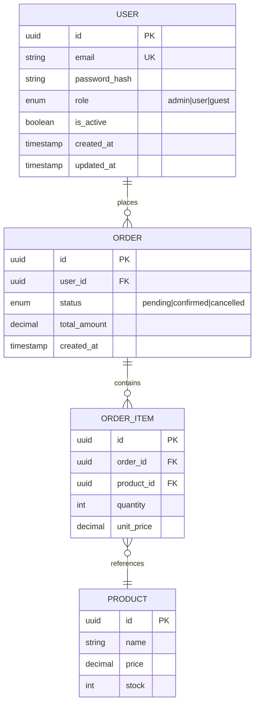

## Tarefa

Projetar o schema de banco de dados e produzir o ER diagram, db-schema.sql e guia de migrations. Execute os passos abaixo **na ordem**. Toda decisão de schema que não for óbvia deve ser documentada como comentário no SQL.

## Pré-condições obrigatórias

| Arquivo | Obrigatório | Ação se ausente |
|---------|------------|-----------------|
| `.genesis/manifest.md` | ✅ | PARE — rode `/genesis-intake` primeiro |
| `.genesis/architecture/tech-stack.md` | ✅ | PARE — rode `/genesis-architect` primeiro |
| `.genesis/architecture/patterns.md` | ✅ | PARE — rode `/genesis-architect` primeiro |
| `.genesis/context/existing-code.md` | só brownfield | Ignorar se greenfield |

Se `tech-stack.md` não define o banco, pergunte ao usuário antes de continuar — não assuma.

## Regras de schema

- Use UUID como PK em vez de SERIAL quando possível (portabilidade, segurança).
- Sempre inclua `created_at` e `updated_at` em toda tabela.
- Projetos multi-tenant: toda tabela de dados deve ter `org_id` com FK.
- Nunca apague dados — use soft delete (`deleted_at` nullable).
- Índices obrigatórios: PKs, FKs, campos usados em WHERE frequente, campos únicos.

---

## O que você produz

### 1. ER Diagram (`contracts/er-diagram.md`)

```markdown
# ER Diagram — {project_name}

## Diagrama (Mermaid)



## Cardinalidades Justificadas

| Relação | Cardinalidade | Justificativa |
|---------|--------------|---------------|
| User → Tenant | N:1 | Usuário pertence a um tenant |
| User → Order | 1:N | Usuário faz muitos pedidos |
```

### 2. Schema SQL (`contracts/db-schema.sql`)

Para bancos relacionais (PostgreSQL, MySQL):

```sql
-- ============================================================
-- {project_name} — Database Schema
-- Gerado: {data}
-- Banco: PostgreSQL {version}
-- ============================================================

-- Extensões necessárias
CREATE EXTENSION IF NOT EXISTS "uuid-ossp";
CREATE EXTENSION IF NOT EXISTS "pgcrypto";  -- se necessário

-- ============================================================
-- USERS
-- ============================================================
CREATE TABLE users (
    id              UUID        PRIMARY KEY DEFAULT gen_random_uuid(),
    email           VARCHAR(255) NOT NULL UNIQUE,
    password_hash   VARCHAR(255) NOT NULL,
    role            VARCHAR(50) NOT NULL DEFAULT 'user'
                    CHECK (role IN ('admin', 'user', 'guest')),
    is_active       BOOLEAN     NOT NULL DEFAULT TRUE,
    created_at      TIMESTAMPTZ NOT NULL DEFAULT NOW(),
    updated_at      TIMESTAMPTZ NOT NULL DEFAULT NOW()
);

-- Índices
CREATE INDEX idx_users_email ON users(email);
CREATE INDEX idx_users_role  ON users(role);
-- Se multi-tenant: adicionar org_id FK + índice composto

-- ============================================================
-- {PRÓXIMA ENTIDADE}
-- ============================================================
[continua para cada entidade do manifest]
```

**Regras para o schema:**
- UUID como PK (não integer auto-increment) — portabilidade e segurança
- `created_at` e `updated_at` em toda tabela
- Se multi-tenant: `org_id` FK em toda tabela com isolamento de organização
- Soft delete via `deleted_at TIMESTAMPTZ` (não DELETE físico) para tabelas com auditoria
- Constraints explícitas com nome descritivo (`uq_`, `fk_`, `chk_`)
- Comentários em campos não-óbvios

### 3. Schema MongoDB (se aplicável)

Para MongoDB, gere um schema de validação:

```javascript
// {collection_name} collection
db.createCollection("{collection}", {
  validator: {
    $jsonSchema: {
      bsonType: "object",
      required: ["_id", "user_id", "created_at"],
      properties: {
        _id: { bsonType: "objectId" },
        user_id: { bsonType: "objectId", description: "Owner reference" },
        // ... demais campos do domínio
        created_at: { bsonType: "date" },
        updated_at: { bsonType: "date" }
      }
    }
  }
})

// Índices — adaptar às queries reais do projeto
db.{collection}.createIndex({ user_id: 1 })
db.{collection}.createIndex({ email: 1 }, { unique: true })
```

### 4. Index Strategy (`contracts/index-strategy.md`)

```markdown
# Index Strategy — {project_name}

## Princípios
1. Índice em toda FK
2. Índice em campos usados em WHERE + ORDER BY juntos
3. Índice composto: coluna mais seletiva primeiro
4. Partial index para queries com filtro fixo (ex: WHERE is_active = TRUE)
5. Evitar over-indexing — cada índice custa em writes

## Índices por tabela

### users
| Índice | Colunas | Tipo | Justificativa |
|--------|---------|------|---------------|
| idx_users_email | email | B-tree | Login por email (alta frequência) |
| idx_users_role | role | B-tree | Listagem filtrada por papel |
| idx_users_created | created_at | B-tree | Ordenação cronológica |

### {tabela}
[...]

## Queries que precisam de atenção

| Query | Índice necessário | Complexidade esperada |
|-------|-----------------|----------------------|
| SELECT * FROM orders WHERE user_id = ? AND status = 'pending' ORDER BY created_at | idx_orders_user_status_created | O(log n) |
```

### 5. Migration Guide (`contracts/migrations.md`)

```markdown
# Migration Strategy — {project_name}

## Ferramenta escolhida
**{Alembic / Flyway / Liquibase / Prisma Migrate / Django Migrations / custom}**
Motivo: {justificativa}

## Convenções de naming
```
{NNNN}_{YYYY_MM_DD}_{descricao_snake_case}.sql
Exemplo: 0001_2024_01_15_create_users_table.sql
```

## Regras de migration

1. **Sempre additive**: adicionar colunas, nunca remover em produção sem deprecation period
2. **Sem dados na migration**: dados iniciais vão em seeds, não em migrations
3. **Idempotente**: `CREATE TABLE IF NOT EXISTS`, `CREATE INDEX IF NOT EXISTS`
4. **Rollback**: toda migration tem rollback documentado
5. **Zero-downtime**: colunas novas com DEFAULT, never NOT NULL sem DEFAULT em produção

## Sequência de migrations

```
0001 — create_tenants
0002 — create_users
0003 — create_{entidade_principal}
0004 — create_{entidade_secundaria}
...
0NNN — seed_initial_data (apenas desenvolvimento)
```

## Padrão de migration zero-downtime (PostgreSQL)

Para adicionar coluna NOT NULL em tabela existente:
```sql
-- Fase 1: adicionar com default (sem lock prolongado)
ALTER TABLE users ADD COLUMN phone VARCHAR(20) DEFAULT NULL;

-- Fase 2: preencher dados (background job)
UPDATE users SET phone = '' WHERE phone IS NULL;

-- Fase 3: aplicar constraint (em manutenção ou com lock curto)
ALTER TABLE users ALTER COLUMN phone SET NOT NULL;
```
```

---

## Regras do Data Architect

### Para relational databases
- Nunca usar integer como PK para entidades expostas na API (use UUID)
- Multi-tenant: se o projeto isola dados por organização, adicionar `org_id` FK em toda tabela relevante
- Soft delete preferido para entidades com auditoria/histórico
- VARCHAR com limite real, não VARCHAR(255) genérico para tudo
- Timestamps sempre com timezone (`TIMESTAMPTZ`, não `TIMESTAMP`)

### Para NoSQL
- Modelar para os queries, não para normalização
- Documentar padrões de acesso antes de modelar
- Evitar joins — desnormalize quando necessário

### Para todos
- Schema é contrato — toda mudança tem migration
- Índices são decisão de performance, não de correção
- Documentar campos não-óbvios com comentários no schema

---

## Ao concluir

1. Apresente resumo:
```
✅ Schema de dados concluído
📋 Produzido:
  - ER Diagram: {N} entidades, {N} relacionamentos
  - Schema SQL: {N} tabelas, {N} índices
  - Migration guide: {N} migrations planejadas
  - Index strategy: {N} índices justificados
```

2. Atualize `.genesis/state.json`:
   - `phase` → `"contracts"`
   - Adicione `"data"` em `completed_phases`
